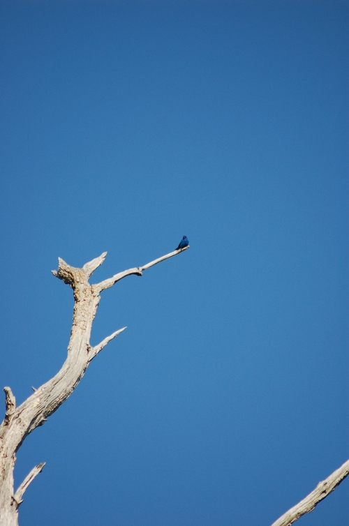
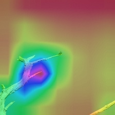

# bird-classification

This repository presents my final solution for a 2019 class Kaggle competition (https://www.kaggle.com/c/mva-recvis-2019) on fine-grained image classification. The goal of this competition was to design a model that had maximum test accuracy on Image Classification of a subset of 20 classes and 1702 images of the Birds200 dataset. I achieved 92.258% of accuracy in the public leaderboard (2nd place), and 91.436% of accuracy in the private leaderboard (2nd place).

Below is a t-SNE representation of the dataset, showing how close classes are.

The two following images show how hard the task is, with an image example of the test set and a feature map obtained after the block 7 of a ResNext101 pretrained on ImageNet and finetuned on the augmented dataset described below.

Example image            |  Heatmap 
:-------------------------:|:-------------------------:
  |  

The main steps of this solution are:
- A data-augmentation done by cropping birds with a Detectron2 implementation of Mask R-CNN (https://github.com/facebookresearch/detectron2), and an additionnal test augmentation done by duplicating the test set with its horizontally flipped version.
- Feature extraction on the augmented dataset with an Inception3 model trained on ImageNet and the fine-grained image classification dataset iNat2017 (https://github.com/richardaecn/cvpr18-inaturalist-transfer).
- 2-layer classifier of features training, final predictions being obtained by Max-TTA.

More informations about the different techniques I tried are available in the pdf file. Provided notebooks were run on Google Colab.
